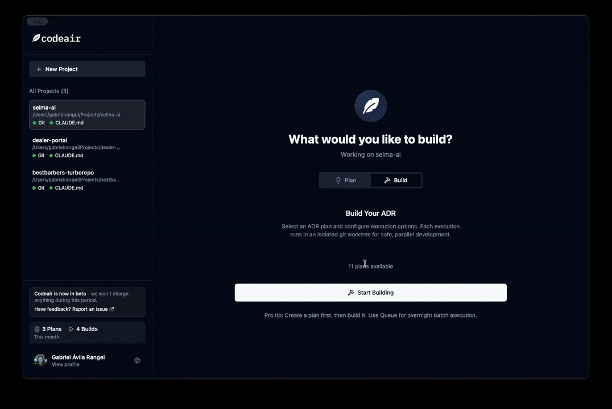

<p align="center">
  
</p>

<h1 align="center">CodeAir</h1>

<p align="center">
  <strong>AI-Powered Development Automation — From Idea to Pull Request</strong>
</p>

<p align="center">
  <a href="https://codeair.ai">Website</a> •
  <a href="https://github.com/seven-apps/codeair-agent/releases">Download</a> •
  <a href="https://github.com/seven-apps/codeair-agent/issues">Feedback</a>
</p>

<p align="center">
  
  
</p>

---

<p align="center">
  
</p>

---

## What is CodeAir?

CodeAir is a lightweight desktop application that automates your entire development workflow using AI. Describe the feature you want to build, and CodeAir handles the rest — from creating a detailed implementation plan to writing the code, reviewing it, and opening a pull request.

**The Problem:** Turning a feature idea into production-ready code involves many repetitive steps: planning, breaking down tasks, writing code, committing changes, reviewing for issues, and creating PRs. This context-switching slows you down.

**The Solution:** CodeAir orchestrates [Claude Code](https://docs.anthropic.com/en/docs/claude-code) to handle this entire lifecycle automatically, letting you focus on what matters — designing great features.

### How It Works

```
1. Describe your feature  →  2. AI generates implementation plan (ADR)
                                        ↓
5. PR created on GitHub  ←  4. Code review & fixes  ←  3. Automated implementation
```

---

## Key Features

### Planning & Architecture
- **ADR Generation** — Describe what you want to build, and CodeAir generates a detailed Architecture Decision Record with phased implementation steps
- **Context-Aware Planning** — Select relevant files from your codebase to give the AI full context
- **Review Before Execution** — Preview and edit the generated plan before any code is written

### Automated Implementation
- **Phase-by-Phase Execution** — Each implementation phase runs sequentially with clear progress tracking
- **Real-Time Output** — Watch the AI work with streaming output from Claude Code
- **Git Integration** — Automatic commits after each phase with descriptive messages

### Quality Assurance
- **Built-in Code Review** — Automated review after implementation identifies issues by priority
- **Auto-Fix Generation** — Issues found during review generate fix phases automatically
- **QA Integration** — Run your existing test suite, linting, and type checking

### Workflow Automation
- **GitHub PR Creation** — Automatically push branches and create pull requests
- **Branch Management** — Feature branches created automatically with consistent naming
- **Resume Capability** — Pick up where you left off if execution is interrupted

### Productivity
- **Batch Execution** — Queue multiple features for overnight execution
- **Multi-Project Support** — Switch between projects seamlessly
- **Next Steps Guidance** — Get actionable suggestions for remaining manual tasks

---

## Getting Started

### Prerequisites

CodeAir requires [Claude Code CLI](https://docs.anthropic.com/en/docs/claude-code) to be installed and authenticated.

```bash
# Install Claude Code
npm install -g @anthropic-ai/claude-code

# Authenticate (follow the prompts)
claude
```

### Installation

1. Download the latest release from [GitHub Releases](https://github.com/seven-apps/codeair-agent/releases)
2. Open the `.dmg` file and drag CodeAir to your Applications folder
3. Launch CodeAir and select your project folder
4. Start building!

---

## Pricing

CodeAir offers a **free plan** with limited executions to get you started. For higher limits and additional features, check out our [subscription plans](https://codeair.ai).

---

## Feedback & Suggestions

We're building CodeAir for developers, and your input shapes the product.

**We welcome:**
- **Bug Reports** — Something not working? [Open an issue](https://github.com/seven-apps/codeair-agent/issues/new?template=bug_report.md)
- **Feature Requests** — Have an idea? [Suggest it here](https://github.com/seven-apps/codeair-agent/issues/new?template=feature_request.md)
- **Questions** — Confused about something? [Ask us](https://github.com/seven-apps/codeair-agent/issues/new)

Every piece of feedback helps us make CodeAir better.

---

<p align="center">
  <a href="https://codeair.ai">codeair.ai</a>
</p>

<p align="center">
  <sub>© 2025 CodeAir. All rights reserved.</sub>
</p>
